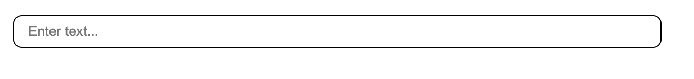
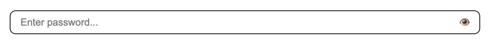
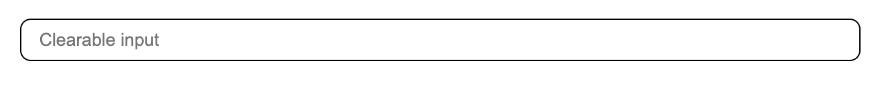
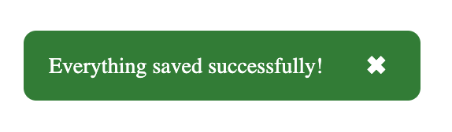
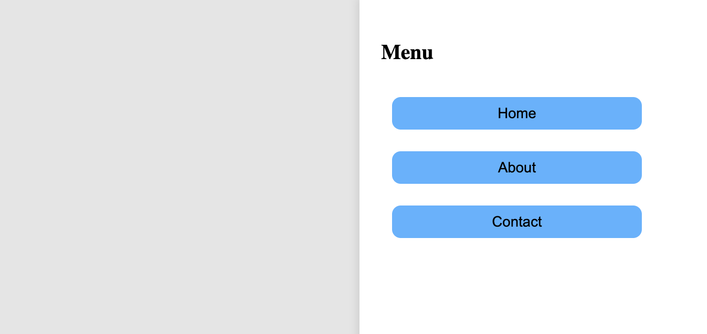
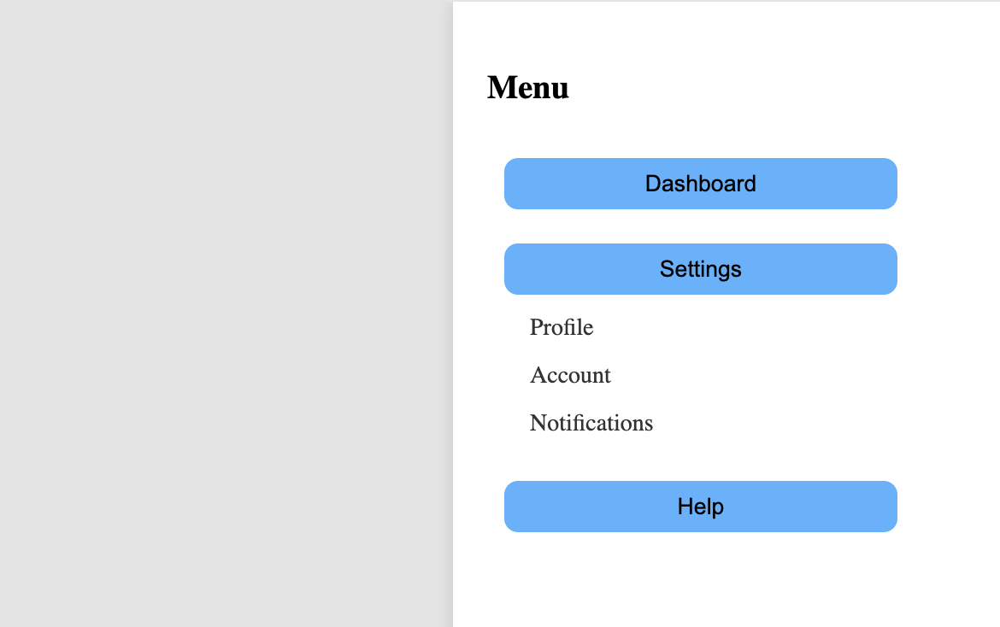

# 🎨 React Component Library (Test Task)

This project is a small **React component library** built with **Vite** and documented using **Storybook**.  
It was created as part of a front-end trainee assessment.

---

## 🚀 Project Overview

The library includes **three reusable UI components**, each displayed and tested via Storybook.

### 🧩 Components

#### 1. Input Component

- Supports `text`, `password`, and `number` types
- Has optional `clearable` mode
- Password fields include a visibility toggle

#### 2. Toast Component

- Appears in the bottom-right corner
- Auto-dismisses after a set duration
- Includes smooth fade-in/fade-out animations
- Supports types: `success`, `error`, `info`, `warning`

#### 3. Sidebar Menu

- Slides in from the right
- Supports nested submenus (accordion style)
- Closes when clicking outside
- Includes a “burger” button when closed

---

## 🧱 Tech Stack

- ⚛️ React (with TypeScript)
- ⚡ Vite
- 📖 Storybook 9
- 💅 CSS Modules
- 🎞️ Optional animations via CSS transitions

---

## 🧩 Storybook Setup

To run the component library in Storybook:

```bash
npm install
npm run storybook
```

## 🖼️ Screenshots

### 🔤 Input Component

| Variant   | Preview                                               |
| --------- | ----------------------------------------------------- |
| Text      |            |
| Password  |    |
| Clearable |  |

### 🔔 Toast Component



### 📂 Sidebar Menu

| State      | Preview                                        |
| ---------- | ---------------------------------------------- |
| One Level  |           |
| Two Levels |  |
